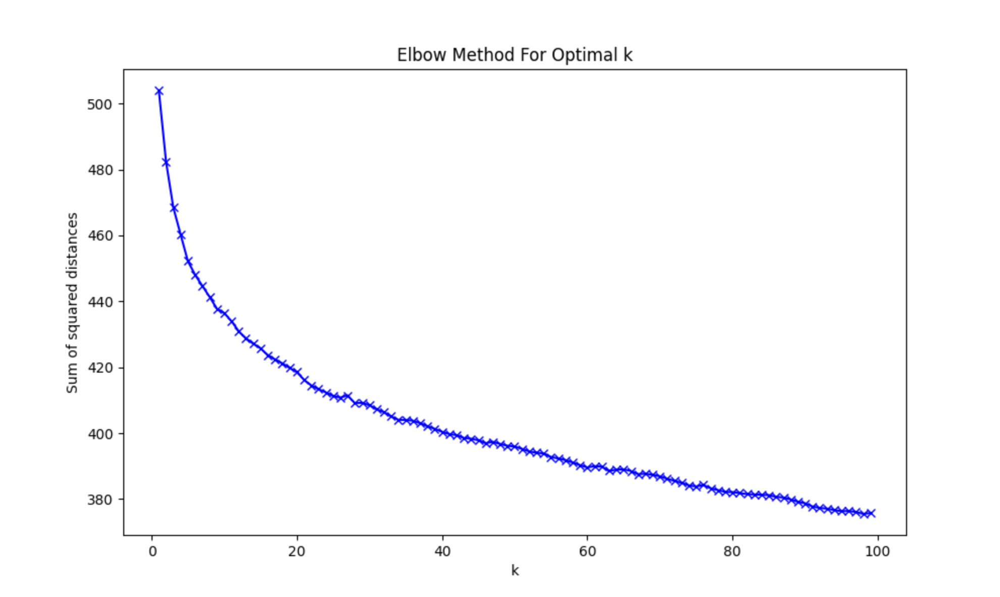

# mormon_queer_analysis

Historical analysis of reddit discourse regarding LGBT issues on the LDS-related subreddits. 

A personal project where I tested out some new tools like Dagster and DuckDB.

## The stack

- [Dagster](https://dagster.io/): data orchestration. A more modern Airflow alternative, Dagster's doing most of the heavy lifting in this project
- [dbt](https://www.getdbt.com/product/what-is-dbt): data build tool 
- [DuckDB](https://duckdb.org/why_duckdb): an embedded analytical database. Lightweight enough to run locally alongside my pipelines, nimble enough for online analytical processing (OLAP)
- [OpenAI API](https://openai.com/blog/openai-api): text embeddings and summaries of the clusters 
- [Poetry](https://python-poetry.org/): dependency manager. If I ever come back to this project 3 years from now, when all the dependencies are out of date and pip has updated how it resolves conflicts, Poetry will 
- [scikit-learn](https://scikit-learn.org/stable/modules/generated/sklearn.cluster.KMeans.html): K-means clustering
- [Streamlit](https://streamlit.io/): creating and hosting (for free!) an interactive data visualization 
- [Arctic Shift API](https://github.com/ArthurHeitmann/arctic_shift/tree/master/api): source of historic reddit data. No money went towards buying Reddit data in this project.

## Results

<iframe src="https://lds-lgbt-app-algl4vdm3jedzrnpc3alh9.streamlit.app/" width="700" height="400"></iframe>
If the streamlit app has gone stale, you can refresh it [here](https://lds-lgbt-app-algl4vdm3jedzrnpc3alh9.streamlit.app/). 


### Interesting findings:
- Many of the clusters seemed to respond to current events like The Boy Scouts of America rescinding the long-standing ban on openly homosexual youth in the program, publicized suicides and studies on gay suicide, and California's Prop 8. 
- Spikes in calls for no personal attacks immediately follow spikes in sarcastic comments.
- Predictably, r/exmormon had the most discussion on leaving the faith.
- The "homosexuality is a sin" frequency did not decline over the last decade, with spikes as recently as summer 2021. 
- Many of the comments were quite intimate, sharing personal experiences and kindly advice.
- Polygamy comparisons held steady over time.
- OpenAI's embeddings tended to cluster similar but opposing statements very closely. E.g. "I believe in gay marriage" was closer to "I don't believe in gay marriage" than it was to "I support human rights". This made it relatively unhelpful for analysis on support and opposition for LGBT issues. 

## Project structure and highlights

This project tested out useful patterns for many Dagster concepts, including:

### Organizing assets in groups

[Software-defined assets](/concepts/assets/software-defined-assets) - An asset is a software object that models a data asset. The prototypical example is a table in a database or a file in cloud storage.

This project contains three asset groups:

<!---
#TODO add screenshots of the Dagster UI
-->

- [`Reddit`](https://github.com/Joe-Koch/mormon-queer-analysis/blob/main/mormon_queer_analysis/assets/reddit.py): Retrieves reddit posts and comments from LDS subreddits, and filters it down to media relevant to LGBTQ+ issues.

- [`OpenAI`](https://github.com/Joe-Koch/mormon-queer-analysis/blob/main/mormon_queer_analysis/assets/open_ai.py): Creates OpenAI embeddings for reddit posts and comments, performs K-means clustering, and generates cluster summaries using the ChatGPT API. 

- [`Visualization`](https://github.com/Joe-Koch/mormon-queer-analysis/blob/main/mormon_queer_analysis/assets/streamlit.py): Exports a database to be used in the final streamlit visualization.

### Varying external services or I/O without changing your DAG

[Resources](mormon_queer_analysis/resources/__init__.py) - A resource is an object that models a connection to a (typically) external service. Resources can be shared between assets, and different implementations of resources can be used depending on the environment. In this example, we built [multiple Hacker News API resources](https://github.com/dagster-io/dagster/blob/master/examples/project_fully_featured/project_fully_featured/resources/hn_resource.py), all of which have the same interface but different implementations:

- `OpenAIClientResource` interacts with the OpenAI API and gets the full text embeddings or text summaries, which will be used in the full pipeline.
- `OpenAISubsampleClientResource` talks to the real API but subsamples the data, which is much faster and cheaper than the normal implementation and is great for demoing purposes.

The way Dagster models resources helps separate the business logic in code from environments, e.g. you can easily switch resources without changing your pipeline code.

[I/O managers](/concepts/io-management/io-managers) - An I/O manager is a special kind of resource that handles storing and loading assets. This project includes:

- [`FilesystemIOManager`](https://docs.dagster.io/_apidocs/io-managers#dagster.FilesystemIOManager): stores outputs as files in your local file system. It minimizes setup difficulty and is useful for local development.
- [DuckDBIOManager](https://docs.dagster.io/_apidocs/libraries/dagster-duckdb): Dagster provided DuckDB I/O manager that can store and load data as Pandas or PySpark DataFrames. Useful for local development since DuckDB runs locally and requires minimal setup. In this example, a DuckDB I/O manager that can handle Pandas and PySpark DataFrames is built using the <PyObject module="dagster_duckdb" object="build_duckdb_io_manager" /> function.

### Testing

[Testing](/concepts/testing) - All Dagster entities are unit-testable. This project includes lightweight invocations in unit tests, including:

- [Testing assets](/mormon_queer_analysis_tests/test_assets.py) by directly invoking the <PyObject object="asset" decorator />-decorated functions. Read more about testing assets on the [Testing](https://docs.dagster.io/concepts/testing#testing-software-defined-assets) page.
- [Testing I/O managers](/mormon_queer_analysis_tests/test_duckdb_io_manager.py) by mocking the I/O and constructing <PyObject object="OutputContext" /> and <PyObject object="InputContext" /> with the mocks. Check out [Testing an IO manager](/concepts/io-management/io-managers#testing-an-io-manager) to learn more.

### Environments

One of my favorite things about Dagster is how easy it is to have different resource configurations for each environment. This project uses two:

- A production deployment, which uses a DuckDB I/O manager, and uses all 20-ish years of Reddit posts and comments. 
- A local deployment, which stores assets in the local filesystem, and reduces costs by using a smaller subset of time and subsamples how much data is send to the OpenAI API

Having a lighter environment for testing and a fuller environment for the final result helped keep this project under budget (which was about $15 in OpenAI credits).

By default, it will load for the local deployment. You can toggle deployments by setting the `DAGSTER_DEPLOYMENT` env var to `production` or `local`.

## ML models used

This project uses OpenAI's API to create text embeddings of the reddit posts and comments, then scikit-learn for K-means clustering, then OpenAI's text generation to produce summaries and titles for each of the clusters. Many of the clusters were vaguely titled, redundant, or irrelevant (like meta-commentary complaining about Reddit), so I omitted those from the final visualization. 

The elbow method for finding the optimal K for K-means clustering wasn't very clear, at least partially because reddit threads and (human conversations in general) don't inherently have tight clusters. I ended up choosing 32 clusters for the final result. 


[OpenAI models](https://platform.openai.com/docs/models/overview) were chosen to get the best accuracy for the task, with minimizing cost being the top priority. 

## Development

### Installing and adding Python dependencies

Once Poetry is installed (instructions [here](https://python-poetry.org/docs/#installing-with-pipx)), install this project's requirements with
```bash
poetry install 
```
New packages can be added with `poetry add`, e.g.
```bash
poetry add requests pendulum
```

### OpenAI credentials
In order to run the OpenAI jobs, this project requires [an API key with OpenAI](https://platform.openai.com/docs/quickstart/step-2-set-up-your-api-key). 
> **⚠️ Warning:** OpenAI does charge money to use its API. 

Once you have credentials, you can store them in a `.env` file.
```
# .env
OPENAI_API_KEY=yourapikey
```
> **⚠️ Warning:** Don't upload .env files to git, they contain secrets.

Using environment variables to provide secrets ensures sensitive info won't be visible in your code or the launchpad in the UI. This project follows [Dagster's best practices](https://docs.dagster.io/guides/dagster/using-environment-variables-and-secrets#handling-secrets) for handling secrets through configuration and resources. 

### Running Dagster locally

Once the requirements are installed, you can start the Dagster UI web server:

```bash
dagster dev
```

Open http://localhost:3000 with your browser to see the project.

Dagster assets are stored in `mormon_queer_analysis/assets.py`. The assets are automatically loaded into the Dagster code location as you define them.

### Unit testing

Tests are in the `mormon_queer_analysis_tests` directory and you can run tests using `pytest`:

```bash
pytest mormon_queer_analysis_tests
```
